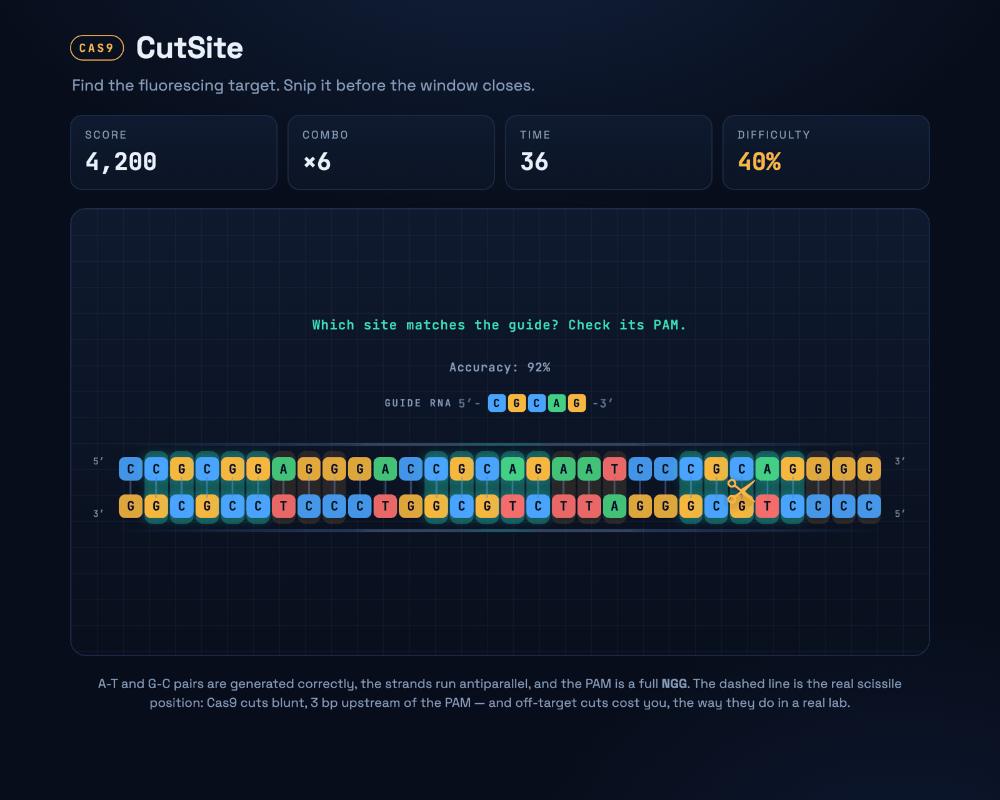

# CutSite

**A browser game about CRISPR gene editing.** A stretch of DNA fluoresces next to
its **PAM** site, and you have to snip it with the Cas9 scissors before the window
closes. Fast, accurate cuts build a combo and multiply your score.

### [▶ Play it](https://rachelselbrede.github.io/cutsite/)



*Guide RNA mode above. Three sites glow, but only one is cuttable: the left one has
an intact PAM but a mismatch in its seed region, the middle one matches the guide
perfectly yet has no `NGG` beside it, and only the right one satisfies both.*

Built with plain HTML, CSS, and JavaScript — nothing to install, no dependencies,
no build step. To run it locally, open `index.html` in a browser.

## Modes and features

- **Classic** — 30-second rounds; the reaction window tightens as you land cuts.
- **Zen** — endless practice, no clock.
- **Guide RNA** — 45-second rounds where decoy sites fluoresce alongside the real
  one. Read the guide and cut only the site that matches it beside a genuine `NGG`.
- **Off-target penalty** — cutting anything else resets your combo and jams the
  blades for a moment, so precision beats spraying clicks.
- **Leaderboards** — top 10 scores per mode, kept in browser storage.
- **Achievements** — six unlockables that persist across sessions.
- **Feedback** — screen shake on fast cuts, particle bursts, synthesised sound
  (no audio files), and a live accuracy readout.
- **Plays on a phone** — the strand shortens on narrow screens so every base pair
  stays big enough to tap.

## The science behind the game

CRISPR-Cas9 is a real gene-editing system. The short version of how it cuts:

- A **guide RNA** carries a ~20-letter sequence that matches a target spot in the genome.
- Cas9 will only cut next to a short signal called a **PAM** (in the common
  *S. pyogenes* Cas9, the PAM is `NGG`, so it ends in two Gs).
- When the guide matches and a PAM sits right beside it, Cas9 makes a **blunt**
  double-strand break a fixed **3 bp upstream** of the PAM.

Cas9's biggest real-world problem is the **off-target cut**: the enzyme snips a
site that only partly matches the guide. The game charges you for that too. Cut
anywhere other than the fluorescing window and you lose your combo and the blades
jam briefly, so accuracy matters as much as speed.

This game keeps those ideas and simplifies the rest:

- The DNA is drawn as base pairs, and the pairing is correct: A always sits
  across from T, and G always sits across from C. The two strands are marked
  5'/3' and run antiparallel, as real duplex DNA does.
- Every target carries a full `NGG` **PAM** immediately 3' of it: three bases,
  of which only the two Gs are fixed. The N really is whatever base happens to
  be there.
- The dashed amber line is the **scissile position**. Cas9 breaks the duplex
  bluntly, 3 bp upstream of the PAM, and that is exactly where the game draws
  it rather than severing the whole target window.
- The **guide RNA** readout above the strand shows the loaded guide's spacer
  as RNA, 5' to 3' with U in place of T. It reads the same as the target's
  top strand because that is the strand it *does not* pair with: the guide
  base-pairs with the bottom strand, which is why the top one has to match.
- In **Guide RNA mode** several sites glow at once and only one is real. The
  decoys fail the way real sites fail: a perfect sequence match with **no
  PAM** (Cas9 never even unwinds DNA that lacks an `NGG`), or an intact PAM
  next to a **seed mismatch** in the bases nearest it, where the guide has to
  pair or the enzyme lets go. Cutting a decoy counts as off-target.
- The target length and the 20-letter guide are shortened so the whole thing
  fits on one screen and stays fun.

## How it is built

| File | What it does |
|------|--------------|
| `index.html` | Page structure: scoreboard, the DNA stage, and the start / game-over screens |
| `style.css` | The fluorescence-imaging look, the scissors cursor, and all animations |
| `script.js` | Game logic: drawing the strand, spawning targets, scoring, and sound |
| `cutsite-standalone.html` | The whole game as one file. **Generated** — see below |
| `build-standalone.py` | Builds the standalone file from the three above |
| `og-image.png` | Link-preview card, referenced by the `og:image` meta tag |
| `docs/screenshot.png` | The screenshot at the top of this README |

There is still no build step for playing or deploying the game; `index.html`
loads the CSS and JS directly. The script exists only to produce the single-file
copy, which is handy for emailing the game or opening it off a USB stick.

After editing `index.html`, `style.css`, or `script.js`, regenerate it:

```
python3 build-standalone.py
```

`python3 build-standalone.py --check` verifies the committed copy is current
without writing anything, and exits non-zero if it has fallen behind. Do not
edit `cutsite-standalone.html` by hand — the next build overwrites it.

The JavaScript is organised into clear sections (config, state, the DNA strand,
the target loop, scoring, sound, helpers) and is commented throughout, so it is
easy to read and extend.

## Ideas for next versions

- Difficulty levels, a longer genome that scrolls, or a two-player mode.
- **PAM-distal mismatches** that Cas9 still cuts: the real off-target case,
  where a site tolerates a mismatch far from the PAM and gets edited anyway.
  Today's decoys are all sites Cas9 correctly refuses.
- Other Cas enzymes with their own PAMs (Cas12a's `TTTV`, SaCas9's `NNGRRT`).

## Credits

Made by Rachel Selbrede as a portfolio project. Feedback and pull requests welcome.

Licensed under the [MIT License](LICENSE).
